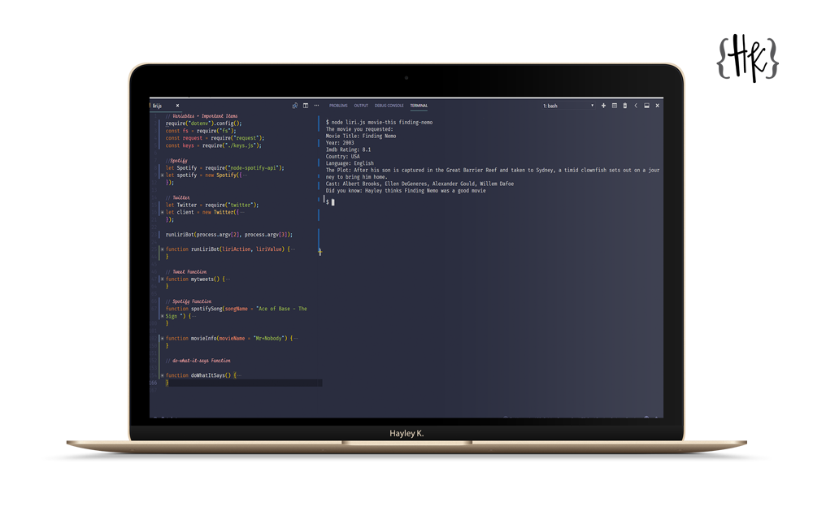
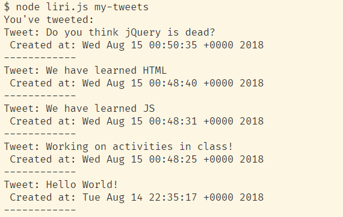
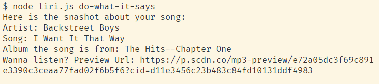

# LIRI-Bot

## About the App

This is a simplified SIRI app, you run in your command line. Give it one of four commands:

- 'my-tweets'
- 'spotify-this'song' plus a Song Name
- 'movie-this' plus a Movie Title
- 'do-what-it-says'

It will work it's magic and provide you with information in return.

## Tools Used

- NodeJS
- Node Packages
  - Twitter
  - Node Spotify-API
  - Request
  - DotEnv

## How do I use this?

- Clone the repo
- Open the folder in your code editior
- In your terminal run npm install to get all the dependancies.
  \*You will need to use your own keys for Twitter, Spotify and OMDB
- Type node liri.js Your-Command (Your Value) and hit enter.

You should return with response like the following:

## Support

If you find an error or bug please [let me know.](https://github.com/CopperCo/LIRI-Bot/issues)
